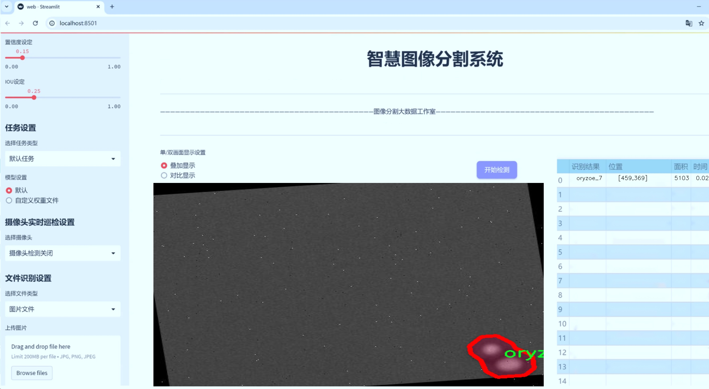
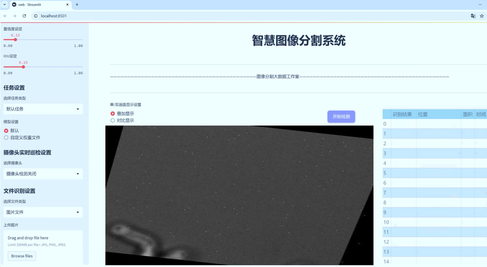
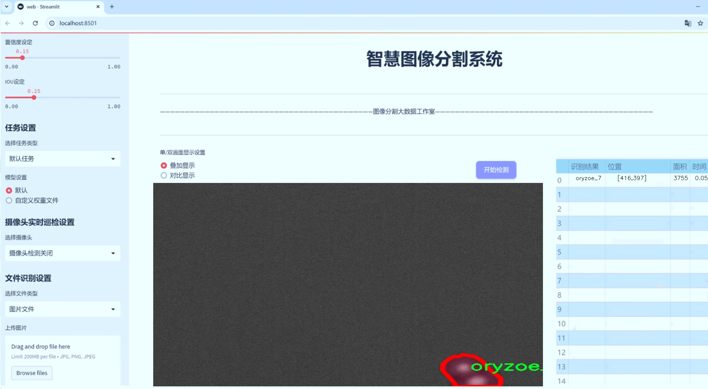
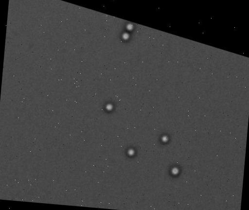
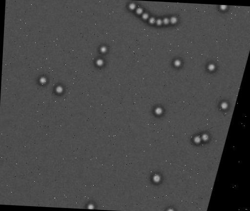
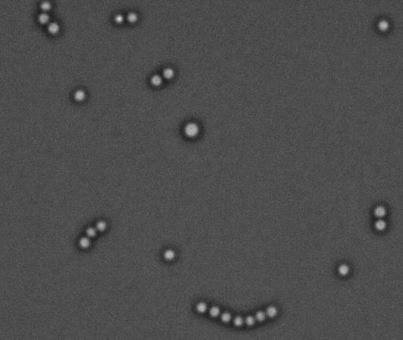
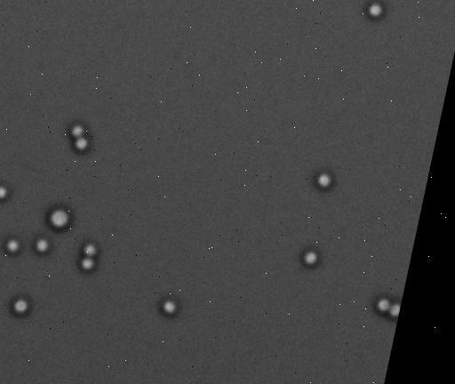

# 真菌孢子图像分割系统： yolov8-seg-CSwinTransformer

### 1.研究背景与意义

[参考博客](https://gitee.com/YOLOv8_YOLOv11_Segmentation_Studio/projects)

[博客来源](https://kdocs.cn/l/cszuIiCKVNis)

研究背景与意义

随着生物技术和计算机视觉技术的迅速发展，真菌孢子的自动识别与分割成为了微生物学、农业科学及食品安全等领域的重要研究方向。真菌孢子不仅在生态系统中扮演着重要角色，还与人类健康和农业生产密切相关。真菌感染可以导致植物病害，影响作物产量和质量，甚至对人类健康造成威胁。因此，开发高效的真菌孢子图像分割系统，对于及时识别和控制真菌的传播具有重要的实际意义。

在这一背景下，YOLO（You Only Look Once）系列目标检测算法因其高效性和准确性，逐渐成为图像分割领域的研究热点。YOLOv8作为该系列的最新版本，具备了更强的特征提取能力和更快的处理速度，适合处理复杂的图像分割任务。然而，传统的YOLOv8在处理真菌孢子图像时，仍面临着多种挑战，包括孢子形态的多样性、背景的复杂性以及图像质量的差异等。因此，基于YOLOv8的改进模型，将为真菌孢子的精确分割提供新的解决方案。

本研究所使用的数据集“sporetrack”包含1400幅图像，涵盖76个类别的真菌孢子。这一丰富的数据集为模型的训练和验证提供了坚实的基础。通过对不同种类的真菌孢子进行实例分割，不仅可以提高模型的泛化能力，还能为后续的真菌种类识别和分类奠定基础。数据集中包含的多种类真菌，如Flavus、Nidulans、Oryzoe、Penicillium和Saccharomyces等，代表了真菌界的多样性，能够有效促进模型对不同真菌特征的学习和识别。

本研究的意义不仅在于技术上的创新，更在于其对实际应用的推动。通过改进YOLOv8模型，能够实现对真菌孢子的高效分割，为农业病害监测、食品安全检测及环境监测等领域提供技术支持。此外，随着深度学习技术的不断进步，基于图像分割的真菌识别系统有望与无人机、机器人等新兴技术结合，实现自动化监测和管理，进一步提升农业生产的智能化水平。

综上所述，基于改进YOLOv8的真菌孢子图像分割系统的研究，不仅具有重要的学术价值，也将为实际应用提供切实可行的解决方案。通过深入探索真菌孢子的图像特征与分割技术的结合，推动相关领域的研究进展，为保障农业生产和人类健康贡献力量。

### 2.图片演示







注意：本项目提供完整的训练源码数据集和训练教程,由于此博客编辑较早,暂不提供权重文件（best.pt）,需要按照6.训练教程进行训练后实现上图效果。

### 3.视频演示

[3.1 视频演示](https://www.bilibili.com/video/BV16EUZYdEM4/)

### 4.数据集信息

##### 4.1 数据集类别数＆类别名

nc: 76
names: ['flavus_1', 'flavus_2', 'flavus_3', 'flavus_4', 'flavus_6', 'flavus_7', 'flavus_8', 'flavus_9', 'nidulans_1', 'nidulans_10', 'nidulans_11', 'nidulans_12', 'nidulans_2', 'nidulans_3', 'nidulans_4', 'nidulans_5', 'nidulans_6', 'nidulans_7', 'nidulans_8', 'nidulans_9', 'oryzoe_1', 'oryzoe_2', 'oryzoe_3', 'oryzoe_4', 'oryzoe_5', 'oryzoe_6', 'oryzoe_7', 'oryzoe_8', 'oryzoe_9', 'penicillium_1', 'penicillium_10', 'penicillium_11', 'penicillium_12', 'penicillium_13', 'penicillium_14', 'penicillium_15', 'penicillium_2', 'penicillium_4', 'penicillium_5', 'penicillium_6', 'penicillium_7', 'penicillium_8', 'penicillium_9', 'saccharomyces_1', 'saccharomyces_10', 'saccharomyces_11', 'saccharomyces_12', 'saccharomyces_13', 'saccharomyces_14', 'saccharomyces_15', 'saccharomyces_16', 'saccharomyces_17', 'saccharomyces_18', 'saccharomyces_19', 'saccharomyces_2', 'saccharomyces_20', 'saccharomyces_21', 'saccharomyces_22', 'saccharomyces_23', 'saccharomyces_24', 'saccharomyces_25', 'saccharomyces_26', 'saccharomyces_27', 'saccharomyces_28', 'saccharomyces_29', 'saccharomyces_3', 'saccharomyces_30', 'saccharomyces_31', 'saccharomyces_32', 'saccharomyces_33', 'saccharomyces_4', 'saccharomyces_5', 'saccharomyces_6', 'saccharomyces_7', 'saccharomyces_8', 'saccharomyces_9']


##### 4.2 数据集信息简介

数据集信息展示

在本研究中，我们使用了名为“sporetrack”的数据集，以训练和改进YOLOv8-seg的真菌孢子图像分割系统。该数据集包含了丰富的真菌孢子图像，旨在为图像分割算法提供多样化的训练样本，从而提高模型在实际应用中的准确性和鲁棒性。数据集的类别数量为76，涵盖了多种真菌种类，具体类别列表包括多种不同的“flavus”、“nidulans”、“oryzoe”、“penicillium”和“saccharomyces”类型。

在“sporetrack”数据集中，类别“flavus”包含了多个变种，如“flavus_1”至“flavus_9”，这些变种展示了不同生长阶段或环境条件下的特征。这种多样性为模型提供了足够的样本，以学习如何在不同情况下识别和分割这些真菌的图像。接下来是“nidulans”类别，涵盖了从“nidulans_1”到“nidulans_12”的多个变种，这些样本同样展示了丰富的形态特征，使得模型能够在多种情况下进行有效的分割。

此外，数据集中还包括“oryzoe”类别，其变种从“oryzoe_1”到“oryzoe_9”，同样提供了多样的样本供模型学习。接着是“penicillium”类别，包含了“penicillium_1”至“penicillium_15”的多种变种，这些变种的特征差异为模型的训练提供了极大的帮助，增强了其对不同真菌孢子的识别能力。最后，数据集中的“saccharomyces”类别更是丰富，从“saccharomyces_1”到“saccharomyces_33”，涵盖了大量的样本，极大地提升了模型的学习深度和广度。

通过这样的类别划分和样本丰富性，“sporetrack”数据集不仅为YOLOv8-seg模型的训练提供了坚实的基础，也为后续的研究和应用奠定了良好的数据支持。模型在经过该数据集的训练后，能够在真实环境中对真菌孢子进行准确的分割，具有重要的实际应用价值，尤其是在农业、食品安全和生物医学等领域。

总之，“sporetrack”数据集以其丰富的类别和样本，为改进YOLOv8-seg的真菌孢子图像分割系统提供了强有力的支持，助力研究者在真菌识别和分割领域取得更为显著的成果。随着技术的不断进步和数据集的不断扩展，未来在真菌孢子识别和相关应用方面将会有更为广阔的发展前景。










### 5.项目依赖环境部署教程（零基础手把手教学）

[5.1 环境部署教程链接（零基础手把手教学）](https://www.bilibili.com/video/BV1jG4Ve4E9t/?vd_source=bc9aec86d164b67a7004b996143742dc)


[5.2 安装Python虚拟环境创建和依赖库安装视频教程链接（零基础手把手教学）](https://www.bilibili.com/video/BV1nA4VeYEze/?vd_source=bc9aec86d164b67a7004b996143742dc)

### 6.手把手YOLOV8-seg训练视频教程（零基础手把手教学）

[6.1 手把手YOLOV8-seg训练视频教程（零基础小白有手就能学会）](https://www.bilibili.com/video/BV1cA4VeYETe/?vd_source=bc9aec86d164b67a7004b996143742dc)


按照上面的训练视频教程链接加载项目提供的数据集，运行train.py即可开始训练



     Epoch   gpu_mem       box       obj       cls    labels  img_size
     1/200     0G   0.01576   0.01955  0.007536        22      1280: 100%|██████████| 849/849 [14:42<00:00,  1.04s/it]
               Class     Images     Labels          P          R     mAP@.5 mAP@.5:.95: 100%|██████████| 213/213 [01:14<00:00,  2.87it/s]
                 all       3395      17314      0.994      0.957      0.0957      0.0843

     Epoch   gpu_mem       box       obj       cls    labels  img_size
     2/200     0G   0.01578   0.01923  0.007006        22      1280: 100%|██████████| 849/849 [14:44<00:00,  1.04s/it]
               Class     Images     Labels          P          R     mAP@.5 mAP@.5:.95: 100%|██████████| 213/213 [01:12<00:00,  2.95it/s]
                 all       3395      17314      0.996      0.956      0.0957      0.0845

     Epoch   gpu_mem       box       obj       cls    labels  img_size
     3/200     0G   0.01561    0.0191  0.006895        27      1280: 100%|██████████| 849/849 [10:56<00:00,  1.29it/s]
               Class     Images     Labels          P          R     mAP@.5 mAP@.5:.95: 100%|███████   | 187/213 [00:52<00:00,  4.04it/s]
                 all       3395      17314      0.996      0.957      0.0957      0.0845


### 7.50+种全套YOLOV8-seg创新点加载调参实验视频教程（一键加载写好的改进模型的配置文件）

[7.1 50+种全套YOLOV8-seg创新点加载调参实验视频教程（一键加载写好的改进模型的配置文件）](https://www.bilibili.com/video/BV1Hw4VePEXv/?vd_source=bc9aec86d164b67a7004b996143742dc)

### YOLOV8-seg算法简介

原始YOLOv8-seg算法原理

YOLOv8-seg算法是2023年1月推出的YOLO系列模型中的最新版本，标志着计算机视觉领域在目标检测和实例分割任务中的又一次重大进步。YOLOv8的设计不仅继承了前几代YOLO模型的优点，还在此基础上进行了多项创新和改进，使其在精度和速度上都超越了现有的模型，成为当前最先进的解决方案之一。

YOLOv8的架构主要由输入层、主干网络、颈部网络和头部网络组成。输入层负责对图像进行预处理，包括缩放和数据增强，以适应模型的输入要求。与以往的YOLO模型不同，YOLOv8在训练的最后阶段停止使用Mosaic数据增强，以避免对数据真实分布的干扰，这一策略有效提升了模型的鲁棒性和泛化能力。

在主干网络中，YOLOv8采用了新的C2f模块，取代了传统的C3模块。C2f模块通过引入更多的跳层连接和Split操作，增强了模型的梯度流动性，使得特征提取更加高效。该模块不仅保留了SPPF（Spatial Pyramid Pooling Fast）结构，还通过优化减少了执行时间，确保了模型在处理多尺度特征时的高效性。SPPF模块的引入，使得YOLOv8能够更好地处理不同尺度的目标，提高了对小目标的检测能力。

颈部网络则利用了特征金字塔网络（FPN）和路径聚合网络（PAN）结构，进一步融合了来自不同尺度的特征图信息。这一设计使得YOLOv8能够在多层次上进行特征整合，从而提高了模型对复杂场景的理解能力。通过这种多尺度特征融合，YOLOv8能够更好地捕捉到目标的细节信息，提高了检测的准确性。

头部网络是YOLOv8的另一个创新点。与以往的耦合检测头不同，YOLOv8采用了解耦检测头的设计思路，将分类和回归任务分为两个并行的分支。这种设计使得模型在处理分类和定位任务时能够更加专注于各自的目标，从而提高了收敛速度和预测精度。此外，YOLOv8引入了无锚框（Anchor-Free）结构，直接预测目标的中心位置，简化了检测过程。这一变化使得模型在面对不同形状和大小的目标时，能够更加灵活地进行定位。

YOLOv8还引入了任务对齐学习（Task Alignment Learning，TAL）机制，以进一步提升分类和定位的精度。通过对分类分数和IOU（Intersection over Union）高次幂乘积的引入，YOLOv8能够更好地衡量任务的对齐程度，从而在损失函数中综合考虑分类和定位的效果。这一创新使得YOLOv8在目标检测任务中，能够同时实现高效的定位和准确的分类，进一步提升了模型的整体性能。

在性能方面，YOLOv8在COCO数据集上的表现尤为突出。通过与其他YOLO系列模型的对比，YOLOv8在相同尺寸下实现了更高的mAP（mean Average Precision），同时在推理速度上也表现出色。这一系列的改进使得YOLOv8不仅适用于高分辨率图像的检测，还能够有效处理小目标的检测任务，满足了实际应用中对实时性和准确性的双重需求。

综上所述，YOLOv8-seg算法通过一系列的结构性创新和性能优化，成功地在目标检测和实例分割领域树立了新的标杆。其在特征提取、特征融合和任务处理上的新颖设计，使得YOLOv8在处理复杂场景和多样化目标时，展现出了卓越的能力。随着YOLOv8的广泛应用，其在垃圾分类、自动驾驶、安防监控等领域的潜力也将不断被挖掘，为未来的计算机视觉研究提供了新的方向和思路。


### 9.系统功能展示（检测对象为举例，实际内容以本项目数据集为准）

图9.1.系统支持检测结果表格显示

  图9.2.系统支持置信度和IOU阈值手动调节

  图9.3.系统支持自定义加载权重文件best.pt(需要你通过步骤5中训练获得)

  图9.4.系统支持摄像头实时识别

  图9.5.系统支持图片识别

  图9.6.系统支持视频识别

  图9.7.系统支持识别结果文件自动保存

  图9.8.系统支持Excel导出检测结果数据


### 10.50+种全套YOLOV8-seg创新点原理讲解（非科班也可以轻松写刊发刊，V11版本正在科研待更新）

#### 10.1 由于篇幅限制，每个创新点的具体原理讲解就不一一展开，具体见下列网址中的创新点对应子项目的技术原理博客网址【Blog】：


[10.1 50+种全套YOLOV8-seg创新点原理讲解链接](https://gitee.com/qunmasj/good)

#### 10.2 部分改进模块原理讲解(完整的改进原理见上图和技术博客链接)【如果此小节的图加载失败可以通过CSDN或者Github搜索该博客的标题访问原始博客，原始博客图片显示正常】

### YOLOv8简介


由上图可以看出，C2中每个BottlNeck的输入Tensor的通道数channel都只是上一级的0.5倍，因此计算量明显降低。从另一方面讲，梯度流的增加，t也能够明显提升收敛速度和收敛效果。
C2i模块首先以输入tensor(n.c.h.w)经过Conv1层进行split拆分，分成两部分(n,0.5c,h,w)，一部分直接经过n个Bottlenck，另一部分经过每一操作层后都会以(n.0.5c,h,w)的尺寸进行Shortcut，最后通过Conv2层卷积输出。也就是对应n+2的Shortcut(第一层Conv1的分支tensor和split后的tensor为2+n个bottenlenneck)。
#### Neck
YOLOv8的Neck采用了PANet结构，如下图所示。

Backbone最后SPPF模块(Layer9)之后H、W经过32倍下采样，对应地Layer4经过8倍下采样，Layer6经过16倍下采样。输入图片分辨率为640*640，得到Layer4、Layer6、Layer9的分辨率分别为80*80、40*40和20*20。
Layer4、Layer6、Layer9作为PANet结构的输入，经过上采样，通道融合，最终将PANet的三个输出分支送入到Detect head中进行Loss的计算或结果解算。
与FPN(单向，自上而下)不同的是，PANet是一个双向通路网络，引入了自下向上的路径，使得底层信息更容易传递到顶层。
#### Head
Head部分相比Yolov5改动较大，直接将耦合头改为类似Yolo的解耦头结构(Decoupled-Head)，将回归分支和预测分支分离，并针对回归分支使用了Distribution Focal Loss策略中提出的积分形式表示法。之前的目标检测网络将回归坐标作为一个确定性单值进行预测，DFL将坐标转变成一个分布。


### LSKNet的架构
该博客提出的结构层级依次为：

LSK module（大核卷积序列+空间选择机制） < LSK Block （LK Selection + FFN）<LSKNet（N个LSK Block）


#### LSK 模块

LSK Block
LSKNet 是主干网络中的一个可重复堆叠的块（Block），每个LSK Block包括两个残差子块，即大核选择子块（Large Kernel Selection，LK Selection）和前馈网络子块（Feed-forward Network ，FFN），如图8。LK Selection子块根据需要动态地调整网络的感受野，FFN子块用于通道混合和特征细化，由一个全连接层、一个深度卷积、一个 GELU 激活和第二个全连接层组成。

LSK module（LSK 模块，图4）由一个大核卷积序列（large kernel convolutions）和一个空间核选择机制（spatial kernel selection mechanism）组成，被嵌入到了LSK Block 的 LK Selection子块中。

#### Large Kernel Convolutions
因为不同类型的目标对背景信息的需求不同，这就需要模型能够自适应选择不同大小的背景范围。因此，作者通过解耦出一系列具有大卷积核、且不断扩张的Depth-wise 卷积，构建了一个更大感受野的网络。

具体地，假设序列中第i个Depth-wise 卷积核的大小为 ，扩张率为 d，感受野为 ，它们满足以下关系：


卷积核大小和扩张率的增加保证了感受野能够快速增大。此外，我们设置了扩张率的上限，以保证扩张卷积不会引入特征图之间的差距。


Table2的卷积核大小可根据公式（1）和（2）计算，详见下图：


这样设计的好处有两点。首先，能够产生具有多种不同大小感受野的特征，便于后续的核选择；第二，序列解耦比简单的使用一个大型卷积核效果更好。如上图表2所示，解耦操作相对于标准的大型卷积核，有效地将低了模型的参数量。

为了从输入数据  的不同区域获取丰富的背景信息特征，可采用一系列解耦的、不用感受野的Depth-wise 卷积核：


其中，是卷积核为 、扩张率为  的Depth-wise 卷积操作。假设有个解耦的卷积核，每个卷积操作后又要经过一个的卷积层进行空间特征向量的通道融合。


之后，针对不同的目标，可基于获取的多尺度特征，通过下文中的选择机制动态选择合适的卷积核大小。

这一段的意思可以简单理解为：

把一个大的卷积核拆成了几个小的卷积核，比如一个大小为5，扩张率为1的卷积核加上一个大小为7，扩张率为3的卷积核，感受野为23，与一个大小为23，扩张率为1的卷积核的感受野是一样的。因此可用两个小的卷积核替代一个大的卷积核，同理一个大小为29的卷积核也可以用三个小的卷积代替（Table 2），这样可以有效的减少参数，且更灵活。

将输入数据依次通过这些小的卷积核（公式3），并在每个小的卷积核后面接上一个1×1的卷积进行通道融合（公式4）。

#### Spatial Kernel Selection
为了使模型更关注目标在空间上的重点背景信息，作者使用空间选择机制从不同尺度的大卷积核中对特征图进行空间选择。

首先，将来自于不同感受野卷积核的特征进行concate拼接，然后，应用通道级的平均池化和最大池化提取空间关系，其中， 和  是平均池化和最大池化后的空间特征描述符。为了实现不同空间描述符的信息交互，作者利用卷积层将空间池化特征进行拼接，将2个通道的池化特征转换为N个空间注意力特征图，之后，将Sigmoid激活函数应用到每一个空间注意力特征图，可获得每个解耦的大卷积核所对应的独立的空间选择掩膜，又然后，将解耦后的大卷积核序列的特征与对应的空间选择掩膜进行加权处理，并通过卷积层进行融合获得注意力特征 ，最后LSK module的输出可通过输入特征  与注意力特征  的逐元素点成获得，公式对应于结构图上的操作如下：


### 11.项目核心源码讲解（再也不用担心看不懂代码逻辑）

#### 11.1 ultralytics\models\utils\loss.py

以下是经过精简和注释的核心代码部分，主要保留了损失计算的核心逻辑和结构。

```python
import torch
import torch.nn as nn
import torch.nn.functional as F
from ultralytics.utils.metrics import bbox_iou
from .ops import HungarianMatcher

class DETRLoss(nn.Module):
    """
    DETR (DEtection TRansformer) 损失类，计算目标检测模型的损失，包括分类损失、边界框损失和GIoU损失。
    """

    def __init__(self, nc=80, loss_gain=None, aux_loss=True, use_fl=True, use_vfl=False):
        """
        初始化DETRLoss类。

        Args:
            nc (int): 类别数量。
            loss_gain (dict): 各损失成分的系数。
            aux_loss (bool): 是否计算辅助损失。
            use_fl (bool): 是否使用FocalLoss。
            use_vfl (bool): 是否使用VarifocalLoss。
        """
        super().__init__()
        if loss_gain is None:
            loss_gain = {'class': 1, 'bbox': 5, 'giou': 2}
        self.nc = nc
        self.matcher = HungarianMatcher(cost_gain={'class': 2, 'bbox': 5, 'giou': 2})
        self.loss_gain = loss_gain
        self.aux_loss = aux_loss
        self.fl = FocalLoss() if use_fl else None
        self.vfl = VarifocalLoss() if use_vfl else None

    def _get_loss_class(self, pred_scores, targets, gt_scores, num_gts):
        """计算分类损失。"""
        bs, nq = pred_scores.shape[:2]
        one_hot = torch.zeros((bs, nq, self.nc + 1), dtype=torch.int64, device=targets.device)
        one_hot.scatter_(2, targets.unsqueeze(-1), 1)  # 创建one-hot编码
        one_hot = one_hot[..., :-1]  # 去掉背景类
        gt_scores = gt_scores.view(bs, nq, 1) * one_hot

        if self.fl:
            loss_cls = self.vfl(pred_scores, gt_scores, one_hot) if num_gts else self.fl(pred_scores, one_hot.float())
            loss_cls /= max(num_gts, 1) / nq
        else:
            loss_cls = nn.BCEWithLogitsLoss(reduction='none')(pred_scores, gt_scores).mean(1).sum()

        return {'loss_class': loss_cls.squeeze() * self.loss_gain['class']}

    def _get_loss_bbox(self, pred_bboxes, gt_bboxes):
        """计算边界框损失和GIoU损失。"""
        loss = {}
        if len(gt_bboxes) == 0:
            return {'loss_bbox': torch.tensor(0.), 'loss_giou': torch.tensor(0.)}

        loss['loss_bbox'] = self.loss_gain['bbox'] * F.l1_loss(pred_bboxes, gt_bboxes, reduction='sum') / len(gt_bboxes)
        loss['loss_giou'] = 1.0 - bbox_iou(pred_bboxes, gt_bboxes, xywh=True, GIoU=True)
        loss['loss_giou'] = loss['loss_giou'].sum() / len(gt_bboxes) * self.loss_gain['giou']
        return loss

    def _get_loss(self, pred_bboxes, pred_scores, gt_bboxes, gt_cls):
        """计算总损失。"""
        match_indices = self.matcher(pred_bboxes, pred_scores, gt_bboxes, gt_cls)
        idx, gt_idx = self._get_index(match_indices)
        pred_bboxes, gt_bboxes = pred_bboxes[idx], gt_bboxes[gt_idx]

        bs, nq = pred_scores.shape[:2]
        targets = torch.full((bs, nq), self.nc, device=pred_scores.device, dtype=gt_cls.dtype)
        targets[idx] = gt_cls[gt_idx]

        gt_scores = torch.zeros([bs, nq], device=pred_scores.device)
        if len(gt_bboxes):
            gt_scores[idx] = bbox_iou(pred_bboxes.detach(), gt_bboxes, xywh=True).squeeze(-1)

        loss = {}
        loss.update(self._get_loss_class(pred_scores, targets, gt_scores, len(gt_bboxes)))
        loss.update(self._get_loss_bbox(pred_bboxes, gt_bboxes))
        return loss

    def forward(self, pred_bboxes, pred_scores, batch):
        """
        前向传播，计算损失。

        Args:
            pred_bboxes (torch.Tensor): 预测的边界框。
            pred_scores (torch.Tensor): 预测的分数。
            batch (dict): 包含真实标签的信息。
        """
        gt_cls, gt_bboxes = batch['cls'], batch['bboxes']
        total_loss = self._get_loss(pred_bboxes[-1], pred_scores[-1], gt_bboxes, gt_cls)
        if self.aux_loss:
            total_loss.update(self._get_loss_aux(pred_bboxes[:-1], pred_scores[:-1], gt_bboxes, gt_cls))
        return total_loss

    @staticmethod
    def _get_index(match_indices):
        """从匹配索引中返回批次索引、源索引和目标索引。"""
        batch_idx = torch.cat([torch.full_like(src, i) for i, (src, _) in enumerate(match_indices)])
        src_idx = torch.cat([src for (src, _) in match_indices])
        dst_idx = torch.cat([dst for (_, dst) in match_indices])
        return (batch_idx, src_idx), dst_idx
```

### 代码注释说明：
1. **类的定义**：`DETRLoss`类用于计算DETR模型的损失，包括分类损失和边界框损失。
2. **初始化方法**：设置类别数量、损失系数、是否使用辅助损失和不同类型的损失函数。
3. **损失计算方法**：
   - `_get_loss_class`：计算分类损失，使用one-hot编码处理目标类。
   - `_get_loss_bbox`：计算边界框损失和GIoU损失。
   - `_get_loss`：整合分类损失和边界框损失。
4. **前向传播方法**：计算模型的总损失，包含辅助损失的选项。
5. **索引获取方法**：处理匹配索引，返回相应的批次和索引。

通过以上精简和注释，代码的核心逻辑和功能得以保留，同时使其更易于理解。

这个文件定义了一个用于目标检测模型的损失计算类，主要是针对DETR（DEtection TRansformer）模型的损失函数。该类的主要功能是计算模型在训练过程中需要优化的不同损失组件，包括分类损失、边界框损失、广义交并比（GIoU）损失，以及可选的辅助损失。

在类的初始化方法中，用户可以指定类别数量、损失系数、是否计算辅助损失、是否使用Focal Loss和Varifocal Loss等参数。如果没有提供损失系数，默认会使用预设的值。该类还创建了一个匈牙利匹配器（HungarianMatcher），用于计算匹配成本和索引。

该类的核心方法包括计算分类损失和边界框损失的私有方法。分类损失的计算基于模型的预测分数和真实标签，通过将真实标签转换为one-hot编码来实现。若使用Focal Loss或Varifocal Loss，则相应地计算损失；否则，使用二元交叉熵损失。边界框损失则使用L1损失和GIoU损失来计算。

此外，该类还提供了计算辅助损失的方法，辅助损失是针对每个解码器层的损失进行计算的。通过匈牙利匹配器，模型的预测边界框和真实边界框会被匹配，以便计算损失。

在前向传播方法中，模型会接收预测的边界框和分数，以及包含真实标签的批次数据。它会调用损失计算方法来获取总损失，并在需要时计算辅助损失。

文件的最后部分定义了一个名为RTDETRDetectionLoss的类，继承自DETRLoss，专门用于RT-DETR模型的损失计算。这个类除了计算标准的检测损失外，还可以处理去噪训练损失，当提供去噪元数据时，会额外计算去噪损失。

总的来说，这个文件的主要目的是为DETR及其变种模型提供一个灵活且可扩展的损失计算框架，以便在训练过程中有效地优化模型性能。

#### 11.2 ultralytics\models\yolo\detect\train.py

以下是经过简化和注释的核心代码部分：

```python
# 导入必要的库
from copy import copy
import numpy as np
from ultralytics.data import build_dataloader, build_yolo_dataset
from ultralytics.engine.trainer import BaseTrainer
from ultralytics.models import yolo
from ultralytics.nn.tasks import DetectionModel
from ultralytics.utils import LOGGER, RANK
from ultralytics.utils.torch_utils import de_parallel, torch_distributed_zero_first

class DetectionTrainer(BaseTrainer):
    """
    DetectionTrainer类用于基于YOLO模型进行目标检测的训练。
    """

    def build_dataset(self, img_path, mode='train', batch=None):
        """
        构建YOLO数据集。

        参数:
            img_path (str): 包含图像的文件夹路径。
            mode (str): 模式，'train'或'val'，用户可以为每种模式自定义不同的数据增强。
            batch (int, optional): 批次大小，适用于'rect'模式。默认为None。
        """
        # 获取模型的最大步幅
        gs = max(int(de_parallel(self.model).stride.max() if self.model else 0), 32)
        # 构建YOLO数据集
        return build_yolo_dataset(self.args, img_path, batch, self.data, mode=mode, rect=mode == 'val', stride=gs)

    def get_dataloader(self, dataset_path, batch_size=16, rank=0, mode='train'):
        """构造并返回数据加载器。"""
        assert mode in ['train', 'val']  # 确保模式有效
        with torch_distributed_zero_first(rank):  # 仅在DDP中初始化数据集
            dataset = self.build_dataset(dataset_path, mode, batch_size)  # 构建数据集
        shuffle = mode == 'train'  # 训练模式下打乱数据
        if getattr(dataset, 'rect', False) and shuffle:
            LOGGER.warning("WARNING ⚠️ 'rect=True'与DataLoader的shuffle不兼容，设置shuffle=False")
            shuffle = False
        workers = self.args.workers if mode == 'train' else self.args.workers * 2  # 设置工作线程数
        return build_dataloader(dataset, batch_size, workers, shuffle, rank)  # 返回数据加载器

    def preprocess_batch(self, batch):
        """对图像批次进行预处理，包括缩放和转换为浮点数。"""
        batch['img'] = batch['img'].to(self.device, non_blocking=True).float() / 255  # 将图像转换为浮点数并归一化
        return batch

    def set_model_attributes(self):
        """设置模型的属性，包括类别数量和名称。"""
        self.model.nc = self.data['nc']  # 将类别数量附加到模型
        self.model.names = self.data['names']  # 将类别名称附加到模型
        self.model.args = self.args  # 将超参数附加到模型

    def get_model(self, cfg=None, weights=None, verbose=True):
        """返回YOLO目标检测模型。"""
        model = DetectionModel(cfg, nc=self.data['nc'], verbose=verbose and RANK == -1)  # 创建检测模型
        if weights:
            model.load(weights)  # 加载权重
        return model

    def plot_training_samples(self, batch, ni):
        """绘制训练样本及其注释。"""
        plot_images(images=batch['img'],
                    batch_idx=batch['batch_idx'],
                    cls=batch['cls'].squeeze(-1),
                    bboxes=batch['bboxes'],
                    paths=batch['im_file'],
                    fname=self.save_dir / f'train_batch{ni}.jpg',
                    on_plot=self.on_plot)

    def plot_metrics(self):
        """从CSV文件中绘制指标。"""
        plot_results(file=self.csv, on_plot=self.on_plot)  # 保存结果图
```

### 代码说明：
1. **导入部分**：导入了所需的库和模块，包括数据处理、模型训练和绘图工具。
2. **DetectionTrainer类**：该类继承自`BaseTrainer`，用于训练YOLO目标检测模型。
3. **build_dataset方法**：根据给定的图像路径和模式构建YOLO数据集，支持训练和验证模式。
4. **get_dataloader方法**：构造数据加载器，支持分布式训练，确保数据加载的有效性。
5. **preprocess_batch方法**：对输入的图像批次进行预处理，将图像数据转换为浮点数并进行归一化。
6. **set_model_attributes方法**：设置模型的类别数量和名称，以便于后续训练。
7. **get_model方法**：创建并返回YOLO目标检测模型，可以选择加载预训练权重。
8. **plot_training_samples方法**：绘制训练样本及其对应的注释，便于可视化训练过程。
9. **plot_metrics方法**：从CSV文件中绘制训练过程中的指标，帮助监控模型性能。

这个程序文件是Ultralytics YOLO（You Only Look Once）模型的训练模块，主要用于目标检测任务。它继承自`BaseTrainer`类，提供了一系列方法来构建数据集、获取数据加载器、预处理图像、设置模型属性、获取模型、验证模型、记录损失、显示训练进度、绘制训练样本和绘制训练指标等功能。

首先，文件导入了一些必要的库和模块，包括NumPy、Ultralytics的各种工具和模型。接着，定义了`DetectionTrainer`类，该类专门用于基于YOLO模型的训练。

在`build_dataset`方法中，程序根据给定的图像路径和模式（训练或验证）构建YOLO数据集。它会根据模型的步幅（stride）计算出一个合适的步幅值，并调用`build_yolo_dataset`函数来创建数据集。

`get_dataloader`方法用于构建并返回数据加载器。它会检查模式是否为训练或验证，并在分布式训练的情况下确保数据集只初始化一次。根据模式，设置是否打乱数据，并返回构建好的数据加载器。

`preprocess_batch`方法负责对图像批次进行预处理，包括将图像转换为浮点数并归一化到0到1之间。

`set_model_attributes`方法用于设置模型的属性，包括类别数量和类别名称等，以确保模型与数据集的一致性。

`get_model`方法返回一个YOLO检测模型，并可选择加载预训练权重。

`get_validator`方法返回一个用于验证YOLO模型的验证器，并定义了损失名称。

`label_loss_items`方法用于返回带有标签的训练损失项字典，便于后续的损失记录和分析。

`progress_string`方法生成一个格式化的字符串，显示训练进度，包括当前的epoch、GPU内存使用情况、损失值、实例数量和图像大小等信息。

`plot_training_samples`方法用于绘制训练样本及其标注，便于可视化训练过程中的数据。

最后，`plot_metrics`和`plot_training_labels`方法分别用于绘制训练指标和创建带标签的训练图，帮助用户更好地理解模型的训练效果。

整体来看，这个文件提供了YOLO模型训练的核心功能，能够帮助用户高效地进行目标检测模型的训练和评估。

#### 11.3 ultralytics\engine\tuner.py

以下是代码中最核心的部分，并附上详细的中文注释：

```python
class Tuner:
    """
    负责YOLO模型超参数调优的类。

    该类通过在给定的迭代次数内变异超参数，并重新训练模型以评估其性能，从而进化YOLO模型的超参数。

    属性：
        space (dict): 超参数搜索空间，包含变异的边界和缩放因子。
        tune_dir (Path): 保存进化日志和结果的目录。
        tune_csv (Path): 保存进化日志的CSV文件路径。

    方法：
        _mutate(hyp: dict) -> dict:
            在`self.space`中指定的边界内变异给定的超参数。

        __call__():
            执行超参数进化，进行多次迭代。
    """

    def __init__(self, args=DEFAULT_CFG, _callbacks=None):
        """
        使用配置初始化Tuner。

        参数：
            args (dict, optional): 超参数进化的配置。
        """
        self.args = get_cfg(overrides=args)  # 获取配置
        self.space = {  # 定义超参数搜索空间
            'lr0': (1e-5, 1e-1),  # 初始学习率
            'lrf': (0.0001, 0.1),  # 最终学习率
            'momentum': (0.7, 0.98, 0.3),  # 动量
            'weight_decay': (0.0, 0.001),  # 权重衰减
            'warmup_epochs': (0.0, 5.0),  # 预热周期
            'box': (1.0, 20.0),  # 盒子损失增益
            'cls': (0.2, 4.0),  # 分类损失增益
            'hsv_h': (0.0, 0.1),  # HSV色调增强
            'hsv_s': (0.0, 0.9),  # HSV饱和度增强
            'hsv_v': (0.0, 0.9),  # HSV亮度增强
            'degrees': (0.0, 45.0),  # 图像旋转
            'translate': (0.0, 0.9),  # 图像平移
            'scale': (0.0, 0.95),  # 图像缩放
            'shear': (0.0, 10.0),  # 图像剪切
            'flipud': (0.0, 1.0),  # 图像上下翻转概率
            'fliplr': (0.0, 1.0),  # 图像左右翻转概率
            'mosaic': (0.0, 1.0),  # 图像混合概率
            'mixup': (0.0, 1.0),  # 图像混合概率
            'copy_paste': (0.0, 1.0)}  # 段落复制粘贴概率
        self.tune_dir = get_save_dir(self.args, name='tune')  # 获取保存目录
        self.tune_csv = self.tune_dir / 'tune_results.csv'  # CSV文件路径
        self.callbacks = _callbacks or callbacks.get_default_callbacks()  # 获取回调函数
        callbacks.add_integration_callbacks(self)  # 添加集成回调
        LOGGER.info(f"Initialized Tuner instance with 'tune_dir={self.tune_dir}'")  # 日志记录

    def _mutate(self, parent='single', n=5, mutation=0.8, sigma=0.2):
        """
        根据`self.space`中指定的边界和缩放因子变异超参数。

        参数：
            parent (str): 父代选择方法：'single'或'weighted'。
            n (int): 考虑的父代数量。
            mutation (float): 在给定迭代中参数变异的概率。
            sigma (float): 高斯随机数生成器的标准差。

        返回：
            (dict): 包含变异超参数的字典。
        """
        if self.tune_csv.exists():  # 如果CSV文件存在：选择最佳超参数并变异
            # 选择父代
            x = np.loadtxt(self.tune_csv, ndmin=2, delimiter=',', skiprows=1)  # 加载CSV数据
            fitness = x[:, 0]  # 第一列为适应度
            n = min(n, len(x))  # 考虑的结果数量
            x = x[np.argsort(-fitness)][:n]  # 选择前n个适应度最高的
            w = x[:, 0] - x[:, 0].min() + 1E-6  # 权重
            if parent == 'single' or len(x) == 1:
                x = x[random.choices(range(n), weights=w)[0]]  # 加权选择
            elif parent == 'weighted':
                x = (x * w.reshape(n, 1)).sum(0) / w.sum()  # 加权组合

            # 变异
            r = np.random  # 随机数生成器
            r.seed(int(time.time()))  # 设置随机种子
            g = np.array([v[2] if len(v) == 3 else 1.0 for k, v in self.space.items()])  # 获取增益
            ng = len(self.space)  # 超参数数量
            v = np.ones(ng)
            while all(v == 1):  # 确保发生变异
                v = (g * (r.random(ng) < mutation) * r.randn(ng) * r.random() * sigma + 1).clip(0.3, 3.0)
            hyp = {k: float(x[i + 1] * v[i]) for i, k in enumerate(self.space.keys())}
        else:
            hyp = {k: getattr(self.args, k) for k in self.space.keys()}  # 初始化超参数

        # 限制在边界内
        for k, v in self.space.items():
            hyp[k] = max(hyp[k], v[0])  # 下限
            hyp[k] = min(hyp[k], v[1])  # 上限
            hyp[k] = round(hyp[k], 5)  # 保留有效数字

        return hyp

    def __call__(self, model=None, iterations=10, cleanup=True):
        """
        当调用Tuner实例时执行超参数进化过程。

        该方法在每次迭代中执行以下步骤：
        1. 加载现有超参数或初始化新超参数。
        2. 使用`_mutate`方法变异超参数。
        3. 使用变异后的超参数训练YOLO模型。
        4. 将适应度分数和变异后的超参数记录到CSV文件中。

        参数：
           model (Model): 预初始化的YOLO模型。
           iterations (int): 进化的代数。
           cleanup (bool): 是否删除迭代权重以减少存储空间。

        注意：
           该方法利用`self.tune_csv`路径对象读取和记录超参数及适应度分数。
        """

        t0 = time.time()  # 记录开始时间
        best_save_dir, best_metrics = None, None  # 初始化最佳保存目录和最佳指标
        (self.tune_dir / 'weights').mkdir(parents=True, exist_ok=True)  # 创建权重保存目录
        for i in range(iterations):
            # 变异超参数
            mutated_hyp = self._mutate()  # 变异超参数
            LOGGER.info(f'Starting iteration {i + 1}/{iterations} with hyperparameters: {mutated_hyp}')  # 日志记录

            metrics = {}
            train_args = {**vars(self.args), **mutated_hyp}  # 合并超参数
            save_dir = get_save_dir(get_cfg(train_args))  # 获取保存目录
            try:
                # 使用变异后的超参数训练YOLO模型
                weights_dir = save_dir / 'weights'
                cmd = ['yolo', 'train', *(f'{k}={v}' for k, v in train_args.items())]  # 训练命令
                assert subprocess.run(cmd, check=True).returncode == 0, 'training failed'  # 运行训练命令
                ckpt_file = weights_dir / ('best.pt' if (weights_dir / 'best.pt').exists() else 'last.pt')  # 获取权重文件
                metrics = torch.load(ckpt_file)['train_metrics']  # 加载训练指标

            except Exception as e:
                LOGGER.warning(f'WARNING ❌️ training failure for hyperparameter tuning iteration {i + 1}\n{e}')  # 训练失败警告

            # 保存结果和变异超参数到CSV
            fitness = metrics.get('fitness', 0.0)  # 获取适应度
            log_row = [round(fitness, 5)] + [mutated_hyp[k] for k in self.space.keys()]  # 记录行
            headers = '' if self.tune_csv.exists() else (','.join(['fitness'] + list(self.space.keys())) + '\n')  # CSV头
            with open(self.tune_csv, 'a') as f:
                f.write(headers + ','.join(map(str, log_row)) + '\n')  # 写入CSV

            # 获取最佳结果
            x = np.loadtxt(self.tune_csv, ndmin=2, delimiter=',', skiprows=1)  # 读取CSV数据
            fitness = x[:, 0]  # 第一列为适应度
            best_idx = fitness.argmax()  # 获取最佳适应度索引
            best_is_current = best_idx == i  # 检查当前是否为最佳
            if best_is_current:
                best_save_dir = save_dir  # 更新最佳保存目录
                best_metrics = {k: round(v, 5) for k, v in metrics.items()}  # 更新最佳指标
                for ckpt in weights_dir.glob('*.pt'):
                    shutil.copy2(ckpt, self.tune_dir / 'weights')  # 复制最佳权重
            elif cleanup:
                shutil.rmtree(ckpt_file.parent)  # 删除迭代权重以减少存储空间

            # 绘制调优结果
            plot_tune_results(self.tune_csv)

            # 保存和打印调优结果
            header = (f'{i + 1}/{iterations} iterations complete ✅ ({time.time() - t0:.2f}s)\n'
                      f'Results saved to {self.tune_dir}\n'
                      f'Best fitness={fitness[best_idx]} observed at iteration {best_idx + 1}\n'
                      f'Best fitness metrics are {best_metrics}\n'
                      f'Best fitness model is {best_save_dir}\n'
                      f'Best fitness hyperparameters are printed below.\n')
            LOGGER.info('\n' + header)  # 日志记录
            data = {k: float(x[best_idx, i + 1]) for i, k in enumerate(self.space.keys())}  # 获取最佳超参数
            yaml_save(self.tune_dir / 'best_hyperparameters.yaml', data=data, header=remove_colorstr(header.replace(self.prefix, '# ')) + '\n')  # 保存最佳超参数
            yaml_print(self.tune_dir / 'best_hyperparameters.yaml')  # 打印最佳超参数
```

### 代码核心部分说明：
1. **Tuner类**：负责超参数调优的主要类，包含初始化、变异超参数和执行调优的逻辑。
2. **超参数空间**：定义了多个超参数及其取值范围，用于指导变异过程。
3. **_mutate方法**：根据已有的超参数和适应度信息，生成新的变异超参数。
4. **__call__方法**：执行超参数调优的主要逻辑，包括变异、训练模型、记录结果等。

这个程序文件 `ultralytics\engine\tuner.py` 是用于超参数调优的模块，专门针对 Ultralytics YOLO 模型进行优化。超参数调优是一个系统性地搜索最佳超参数集的过程，以获得最佳的模型性能。在深度学习模型如 YOLO 中，超参数的微小变化可能会导致模型准确性和效率的显著差异。

在文件中，首先导入了一些必要的库和模块，包括随机数生成、文件操作、时间处理、NumPy 和 PyTorch 等。接着定义了一个 `Tuner` 类，该类负责 YOLO 模型的超参数调优。该类的主要功能是通过一定的迭代次数对超参数进行演化，具体方法是根据搜索空间对超参数进行变异，并重新训练模型以评估其性能。

在 `Tuner` 类的初始化方法中，设置了超参数的搜索空间，包括学习率、动量、权重衰减、数据增强参数等。这些参数的范围和变异因子被定义为字典形式，便于后续的变异操作。类中还定义了用于保存调优结果的目录和 CSV 文件路径。

`_mutate` 方法是超参数变异的核心，负责在给定的边界和缩放因子内变异超参数。它根据已有的调优结果选择父代超参数，并通过随机生成的数值进行变异，确保生成的新超参数在规定的范围内。

`__call__` 方法是执行超参数演化过程的主要方法。在这个方法中，程序会迭代指定的次数，每次迭代中加载或初始化超参数，调用 `_mutate` 方法生成变异后的超参数，然后使用这些超参数训练 YOLO 模型。训练完成后，记录模型的性能指标和变异后的超参数到 CSV 文件中。

在每次迭代结束后，程序会检查当前的最佳结果，并根据需要清理不必要的文件，以节省存储空间。最后，程序会绘制调优结果的图表，并将最佳超参数保存到 YAML 文件中，以便后续使用。

总体来说，这个模块提供了一种系统化的方法来优化 YOLO 模型的超参数，通过迭代和变异来寻找最佳的模型配置，从而提高模型在各种任务上的表现。

#### 11.4 ultralytics\models\yolo\segment\train.py

以下是代码中最核心的部分，并附上详细的中文注释：

```python
from ultralytics.models import yolo
from ultralytics.nn.tasks import SegmentationModel
from ultralytics.utils import DEFAULT_CFG, RANK
from ultralytics.utils.plotting import plot_images, plot_results

class SegmentationTrainer(yolo.detect.DetectionTrainer):
    """
    扩展DetectionTrainer类，用于基于分割模型的训练。
    """

    def __init__(self, cfg=DEFAULT_CFG, overrides=None, _callbacks=None):
        """初始化SegmentationTrainer对象，接受配置和重写参数。"""
        if overrides is None:
            overrides = {}
        overrides['task'] = 'segment'  # 设置任务类型为分割
        super().__init__(cfg, overrides, _callbacks)  # 调用父类的初始化方法

    def get_model(self, cfg=None, weights=None, verbose=True):
        """返回使用指定配置和权重初始化的SegmentationModel模型。"""
        model = SegmentationModel(cfg, ch=3, nc=self.data['nc'], verbose=verbose and RANK == -1)
        if weights:
            model.load(weights)  # 如果提供了权重，则加载权重

        return model  # 返回初始化的模型

    def get_validator(self):
        """返回SegmentationValidator实例，用于YOLO模型的验证。"""
        self.loss_names = 'box_loss', 'seg_loss', 'cls_loss', 'dfl_loss'  # 定义损失名称
        return yolo.segment.SegmentationValidator(self.test_loader, save_dir=self.save_dir, args=copy(self.args))

    def plot_training_samples(self, batch, ni):
        """创建训练样本图像的绘图，包括标签和框坐标。"""
        plot_images(batch['img'],
                    batch['batch_idx'],
                    batch['cls'].squeeze(-1),
                    batch['bboxes'],
                    batch['masks'],
                    paths=batch['im_file'],
                    fname=self.save_dir / f'train_batch{ni}.jpg',
                    on_plot=self.on_plot)

    def plot_metrics(self):
        """绘制训练和验证的指标。"""
        plot_results(file=self.csv, segment=True, on_plot=self.on_plot)  # 保存结果为results.png
```

### 代码核心部分说明：
1. **类定义**：`SegmentationTrainer`类继承自`DetectionTrainer`，用于处理分割任务的训练。
2. **初始化方法**：在`__init__`方法中，设置任务类型为分割，并调用父类的初始化方法。
3. **模型获取**：`get_model`方法用于创建和返回一个分割模型实例，并可选择性地加载预训练权重。
4. **验证器获取**：`get_validator`方法返回一个验证器实例，用于在训练过程中进行模型验证，并定义损失名称。
5. **绘图方法**：`plot_training_samples`和`plot_metrics`方法用于可视化训练样本和训练过程中的指标，帮助分析模型的训练效果。

这个程序文件是用于训练YOLO（You Only Look Once）模型的分割（Segmentation）任务的，属于Ultralytics YOLO库的一部分。它定义了一个名为`SegmentationTrainer`的类，该类继承自`DetectionTrainer`，并扩展了其功能以支持图像分割任务。

在类的初始化方法`__init__`中，首先设置了默认配置和覆盖参数。如果没有提供覆盖参数，则会创建一个空字典，并将任务类型设置为“segment”，然后调用父类的初始化方法以完成对象的初始化。

`get_model`方法用于返回一个初始化好的分割模型`SegmentationModel`，该模型使用指定的配置和权重进行初始化。如果提供了权重参数，模型会加载这些权重。这个方法确保了模型能够根据当前的数据集和配置进行训练。

`get_validator`方法返回一个分割验证器`SegmentationValidator`的实例，用于对YOLO模型进行验证。在这个方法中，还定义了损失名称，包括边界框损失、分割损失、分类损失和DFL损失，以便在训练过程中进行监控。

`plot_training_samples`方法用于生成训练样本的可视化图像。它接收一个批次的图像数据，并绘制出带有标签和边界框坐标的图像。生成的图像会保存到指定的目录中，文件名包含当前批次的索引。

最后，`plot_metrics`方法用于绘制训练和验证过程中的指标图。它调用`plot_results`函数，将训练结果保存为一个图像文件，以便于后续分析和评估模型的性能。

整体而言，这个文件为YOLO模型的分割任务提供了一个完整的训练框架，包含模型初始化、验证、训练样本可视化和指标绘制等功能。通过使用这个类，用户可以方便地进行图像分割模型的训练和评估。

#### 11.5 demo_test_camera.py

以下是代码中最核心的部分，并附上详细的中文注释：

```python
import cv2
import numpy as np
from PIL import ImageFont, ImageDraw, Image
from hashlib import md5
from model import Web_Detector
from chinese_name_list import Label_list

def generate_color_based_on_name(name):
    # 使用哈希函数生成稳定的颜色
    hash_object = md5(name.encode())  # 对名字进行MD5哈希
    hex_color = hash_object.hexdigest()[:6]  # 取前6位16进制数作为颜色值
    r, g, b = int(hex_color[0:2], 16), int(hex_color[2:4], 16), int(hex_color[4:6], 16)  # 转换为RGB
    return (b, g, r)  # OpenCV 使用BGR格式

def draw_with_chinese(image, text, position, font_size=20, color=(255, 0, 0)):
    # 在图像上绘制中文文本
    image_pil = Image.fromarray(cv2.cvtColor(image, cv2.COLOR_BGR2RGB))  # 转换为PIL格式
    draw = ImageDraw.Draw(image_pil)  # 创建绘图对象
    font = ImageFont.truetype("simsun.ttc", font_size, encoding="unic")  # 加载中文字体
    draw.text(position, text, font=font, fill=color)  # 绘制文本
    return cv2.cvtColor(np.array(image_pil), cv2.COLOR_RGB2BGR)  # 转换回OpenCV格式

def draw_detections(image, info):
    # 在图像上绘制检测结果
    name, bbox = info['class_name'], info['bbox']  # 获取类别名称和边界框
    x1, y1, x2, y2 = bbox  # 解包边界框坐标
    cv2.rectangle(image, (x1, y1), (x2, y2), color=(0, 0, 255), thickness=3)  # 绘制边界框
    image = draw_with_chinese(image, name, (x1, y1 - 30), font_size=35)  # 绘制类别名称
    return image

def process_frame(model, image):
    # 处理每一帧图像
    pre_img = model.preprocess(image)  # 预处理图像
    pred = model.predict(pre_img)  # 进行预测
    det = pred[0]  # 获取检测结果

    if det is not None and len(det):
        det_info = model.postprocess(pred)  # 后处理，获取检测信息
        for info in det_info:
            image = draw_detections(image, info)  # 绘制检测结果
    return image

if __name__ == "__main__":
    model = Web_Detector()  # 初始化检测模型
    model.load_model("./weights/yolov8s-seg.pt")  # 加载模型权重

    # 摄像头实时处理
    cap = cv2.VideoCapture(0)  # 打开摄像头
    while cap.isOpened():
        ret, frame = cap.read()  # 读取一帧图像
        if not ret:
            break
        processed_frame = process_frame(model, frame)  # 处理图像
        cv2.imshow('Camera Feed', processed_frame)  # 显示处理后的图像
        if cv2.waitKey(1) & 0xFF == ord('q'):  # 按'q'键退出
            break
    cap.release()  # 释放摄像头
    cv2.destroyAllWindows()  # 关闭所有OpenCV窗口
```

### 代码核心部分说明：
1. **生成颜色**：`generate_color_based_on_name` 函数通过哈希函数生成与名称对应的颜色，确保同一名称总是生成相同的颜色。
2. **绘制中文文本**：`draw_with_chinese` 函数使用PIL库在图像上绘制中文文本，支持中文字体。
3. **绘制检测结果**：`draw_detections` 函数在图像上绘制检测到的物体的边界框和类别名称。
4. **处理每一帧**：`process_frame` 函数负责预处理图像、进行模型预测并绘制检测结果。
5. **实时摄像头处理**：在主程序中，打开摄像头并实时读取图像，处理后显示在窗口中，按下'q'键可退出。

这个程序文件 `demo_test_camera.py` 是一个用于实时视频处理的 Python 脚本，主要功能是通过摄像头捕捉视频流，并对每一帧进行目标检测和分割，最终在视频中标注检测到的对象及其相关信息。

首先，程序导入了一些必要的库，包括 `random`、`cv2`（OpenCV）、`numpy`、`PIL`（用于处理图像）、`hashlib`（用于生成哈希值）、以及自定义的 `Web_Detector` 模型和 `Label_list`。这些库提供了图像处理、计算、绘图等功能。

接下来，定义了几个辅助函数。`generate_color_based_on_name` 函数使用 MD5 哈希算法根据对象名称生成一个稳定的颜色值，确保同一名称的对象在不同帧中具有相同的颜色。`calculate_polygon_area` 函数用于计算多边形的面积，`draw_with_chinese` 函数则用于在图像上绘制中文文本，支持自定义字体和颜色。

`adjust_parameter` 函数根据图像的大小调整参数，以便在不同分辨率下保持一致的绘制效果。`draw_detections` 函数是程序的核心部分，负责在图像上绘制检测到的对象的边界框、掩膜、类别名称以及相关的度量信息（如面积、周长、圆度和颜色值）。如果检测到的对象有掩膜，则会使用不同的颜色填充掩膜区域，并计算相关的几何特征。

`process_frame` 函数负责处理每一帧图像。它首先对图像进行预处理，然后使用模型进行预测，接着对检测结果进行后处理，最后调用 `draw_detections` 函数在图像上绘制检测结果。

在 `__main__` 块中，程序初始化了目标类别名称和模型，加载了预训练的权重文件。接着，程序通过 OpenCV 打开摄像头，进入一个循环，实时读取摄像头的帧并进行处理。处理后的帧通过 `cv2.imshow` 显示在窗口中，用户可以通过按下 'q' 键退出程序。

最后，程序在结束时释放摄像头资源并关闭所有 OpenCV 窗口。整体来看，这个程序实现了一个基于深度学习的实时目标检测与分割的应用，能够在视频流中动态标注检测到的对象及其属性。

### 12.系统整体结构（节选）

### 程序整体功能和构架概括

该程序是一个基于Ultralytics YOLO框架的目标检测和分割系统，主要包括模型训练、超参数调优和实时视频处理功能。程序的架构分为几个主要模块：

1. **损失计算模块** (`loss.py`): 定义了用于目标检测模型的损失函数，支持多种损失计算方法，确保模型在训练过程中能够有效优化。

2. **YOLO检测训练模块** (`train.py`): 提供了YOLO模型的训练框架，负责数据集构建、数据加载、模型初始化、训练过程中的损失记录和可视化等功能。

3. **超参数调优模块** (`tuner.py`): 实现了超参数的自动调优，通过变异和迭代的方式寻找最佳的超参数配置，以提高模型性能。

4. **YOLO分割训练模块** (`segment/train.py`): 扩展了YOLO训练功能，专门针对图像分割任务，提供了相应的模型初始化、验证和可视化功能。

5. **实时视频处理模块** (`demo_test_camera.py`): 实现了通过摄像头捕捉视频流并进行实时目标检测和分割的功能，能够在视频中动态标注检测到的对象及其属性。

### 文件功能整理表

| 文件路径                                         | 功能描述                                                                                     |
|--------------------------------------------------|----------------------------------------------------------------------------------------------|
| `ultralytics/models/utils/loss.py`              | 定义目标检测模型的损失计算类，支持分类损失、边界框损失、GIoU损失等，提供灵活的损失计算框架。  |
| `ultralytics/models/yolo/detect/train.py`       | 提供YOLO模型的训练框架，包括数据集构建、数据加载、模型初始化、损失记录和可视化等功能。      |
| `ultralytics/engine/tuner.py`                   | 实现YOLO模型的超参数调优，通过变异和迭代寻找最佳超参数配置，以提高模型性能。                |
| `ultralytics/models/yolo/segment/train.py`      | 扩展YOLO训练功能，专门针对图像分割任务，提供模型初始化、验证和可视化功能。                  |
| `demo_test_camera.py`                            | 实现实时视频处理，通过摄像头捕捉视频流并进行目标检测和分割，动态标注检测到的对象及其属性。  |

通过这些模块的协同工作，程序能够实现从模型训练到实时应用的完整流程，满足目标检测和分割的需求。

### 13.图片、视频、摄像头图像分割Demo(去除WebUI)代码

在这个博客小节中，我们将讨论如何在不使用WebUI的情况下，实现图像分割模型的使用。本项目代码已经优化整合，方便用户将分割功能嵌入自己的项目中。
核心功能包括图片、视频、摄像头图像的分割，ROI区域的轮廓提取、类别分类、周长计算、面积计算、圆度计算以及颜色提取等。
这些功能提供了良好的二次开发基础。

### 核心代码解读

以下是主要代码片段，我们会为每一块代码进行详细的批注解释：

```python
import random
import cv2
import numpy as np
from PIL import ImageFont, ImageDraw, Image
from hashlib import md5
from model import Web_Detector
from chinese_name_list import Label_list

# 根据名称生成颜色
def generate_color_based_on_name(name):
    ......

# 计算多边形面积
def calculate_polygon_area(points):
    return cv2.contourArea(points.astype(np.float32))

...
# 绘制中文标签
def draw_with_chinese(image, text, position, font_size=20, color=(255, 0, 0)):
    image_pil = Image.fromarray(cv2.cvtColor(image, cv2.COLOR_BGR2RGB))
    draw = ImageDraw.Draw(image_pil)
    font = ImageFont.truetype("simsun.ttc", font_size, encoding="unic")
    draw.text(position, text, font=font, fill=color)
    return cv2.cvtColor(np.array(image_pil), cv2.COLOR_RGB2BGR)

# 动态调整参数
def adjust_parameter(image_size, base_size=1000):
    max_size = max(image_size)
    return max_size / base_size

# 绘制检测结果
def draw_detections(image, info, alpha=0.2):
    name, bbox, conf, cls_id, mask = info['class_name'], info['bbox'], info['score'], info['class_id'], info['mask']
    adjust_param = adjust_parameter(image.shape[:2])
    spacing = int(20 * adjust_param)

    if mask is None:
        x1, y1, x2, y2 = bbox
        aim_frame_area = (x2 - x1) * (y2 - y1)
        cv2.rectangle(image, (x1, y1), (x2, y2), color=(0, 0, 255), thickness=int(3 * adjust_param))
        image = draw_with_chinese(image, name, (x1, y1 - int(30 * adjust_param)), font_size=int(35 * adjust_param))
        y_offset = int(50 * adjust_param)  # 类别名称上方绘制，其下方留出空间
    else:
        mask_points = np.concatenate(mask)
        aim_frame_area = calculate_polygon_area(mask_points)
        mask_color = generate_color_based_on_name(name)
        try:
            overlay = image.copy()
            cv2.fillPoly(overlay, [mask_points.astype(np.int32)], mask_color)
            image = cv2.addWeighted(overlay, 0.3, image, 0.7, 0)
            cv2.drawContours(image, [mask_points.astype(np.int32)], -1, (0, 0, 255), thickness=int(8 * adjust_param))

            # 计算面积、周长、圆度
            area = cv2.contourArea(mask_points.astype(np.int32))
            perimeter = cv2.arcLength(mask_points.astype(np.int32), True)
            ......

            # 计算色彩
            mask = np.zeros(image.shape[:2], dtype=np.uint8)
            cv2.drawContours(mask, [mask_points.astype(np.int32)], -1, 255, -1)
            color_points = cv2.findNonZero(mask)
            ......

            # 绘制类别名称
            x, y = np.min(mask_points, axis=0).astype(int)
            image = draw_with_chinese(image, name, (x, y - int(30 * adjust_param)), font_size=int(35 * adjust_param))
            y_offset = int(50 * adjust_param)

            # 绘制面积、周长、圆度和色彩值
            metrics = [("Area", area), ("Perimeter", perimeter), ("Circularity", circularity), ("Color", color_str)]
            for idx, (metric_name, metric_value) in enumerate(metrics):
                ......

    return image, aim_frame_area

# 处理每帧图像
def process_frame(model, image):
    pre_img = model.preprocess(image)
    pred = model.predict(pre_img)
    det = pred[0] if det is not None and len(det)
    if det:
        det_info = model.postprocess(pred)
        for info in det_info:
            image, _ = draw_detections(image, info)
    return image

if __name__ == "__main__":
    cls_name = Label_list
    model = Web_Detector()
    model.load_model("./weights/yolov8s-seg.pt")

    # 摄像头实时处理
    cap = cv2.VideoCapture(0)
    while cap.isOpened():
        ret, frame = cap.read()
        if not ret:
            break
        ......

    # 图片处理
    image_path = './icon/OIP.jpg'
    image = cv2.imread(image_path)
    if image is not None:
        processed_image = process_frame(model, image)
        ......

    # 视频处理
    video_path = ''  # 输入视频的路径
    cap = cv2.VideoCapture(video_path)
    while cap.isOpened():
        ret, frame = cap.read()
        ......
```


### 14.完整训练+Web前端界面+50+种创新点源码、数据集获取


# [下载链接：https://mbd.pub/o/bread/Z5ecmZlx](https://mbd.pub/o/bread/Z5ecmZlx)